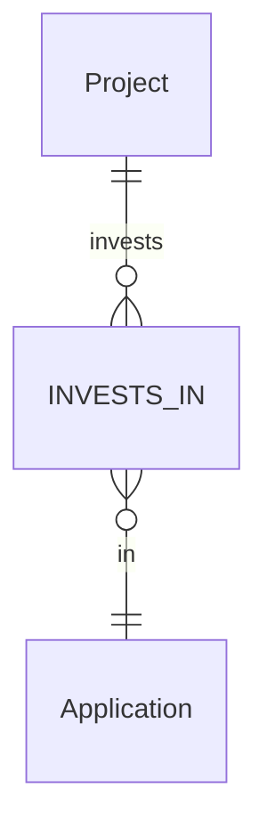

# <Feature Name>

| Field   | Value                |
|---------|----------------------|
| Author  | Ruodong Yang         |
| Date    | YYYY-MM-DD           |
| Status  | Draft                |

---

## 1. Context

One or two paragraphs describing what this feature does, why it exists, and where it fits in the NorthStar system.

### Key Design Decisions

| Decision | Rationale |
|----------|-----------|
| **Decision 1** | Why this approach was chosen over alternatives. |
| **Decision 2** | ... |

---

## 2. Functional Requirements

### 2.1 <Subsystem Name>

| ID | Requirement |
|----|-------------|
| FR-1 | The system MUST ... |
| FR-2 | The system SHOULD ... |

<!-- Group FRs by subsystem. Use RFC keywords: MUST, SHOULD, MAY. -->

---

## 3. Non-Functional Requirements

| ID | Requirement |
|----|-------------|
| NFR-1 | All API responses MUST use the `ApiResponse<T>` envelope with success/data/error. |
| NFR-2 | Neo4j queries MUST avoid cartesian products; use MATCH ... WHERE over MATCH (a), (b). |
| NFR-3 | Long-running ingestion MUST run as FastAPI BackgroundTask, not blocking request. |
| NFR-4 | PostgreSQL writes MUST be idempotent (UPSERT on natural keys). |

---

## 4. Acceptance Criteria

| ID | Given / When / Then | Ref |
|----|---------------------|-----|
| AC-1 | **Given** ..., **When** ..., **Then** ... | FR-1 |

<!-- Each AC must reference one or more FR/NFR IDs. These drive TDD in Phase 3. -->

---

## 5. Edge Cases

| ID | Scenario | Expected Behavior |
|----|----------|-------------------|
| EC-1 | Description of unusual or error scenario. | HTTP 4xx "Error message" or specific system behavior. |

---

## 6. API Contracts

See `api.md` for full endpoint contracts. This section is only for a high-level summary.

---

## 7. Data Models

### 7.1 Neo4j Node Labels & Edges

| Label | Properties | Description |
|-------|-----------|-------------|
| `:Application` | app_id, name, status, cmdb_linked | IT application |

| Edge | From → To | Properties |
|------|-----------|------------|
| `:INVESTS_IN` | Project → Application | fiscal_year, review_status |

### 7.2 PostgreSQL Tables

See `api.md` section 2 for column-level definitions.

### 7.3 ER Diagram

---

## 8. Affected Files

### Backend
- `backend/app/routers/<router>.py` — description
- `backend/app/services/<service>.py` — description

### Frontend
- `frontend/src/app/<path>/page.tsx` — description

### Database
- `backend/sql/NNN_xxx.sql` — schema changes

### Scripts
- `scripts/<script>.py` — description

---

## 9. Test Coverage

### API Tests
| Test File | Covers |
|-----------|--------|
| `api-tests/test_<module>.py::test_<name>` | AC-1, AC-2 |

### E2E Tests (optional)
| Test File | Covers |
|-----------|--------|
| `e2e-tests/<spec>.spec.ts` — "test name" | AC-3 |

---

## 10. Cross-Feature Dependencies

See `docs/features/_DEPENDENCIES.json` for the full graph. This section lists only direct edges.

### This feature depends on:

| Feature | Dependency Type | Details |
|---------|----------------|---------|

### Features that depend on this:

| Feature | Dependency Type | Details |
|---------|----------------|---------|

---

## 11. State Machine / Workflow

Omit this section entirely if the feature is stateless.

---

## 12. Out of Scope / Future Considerations

| Item | Reason |
|------|--------|
| Feature X | Deferred because ... |
