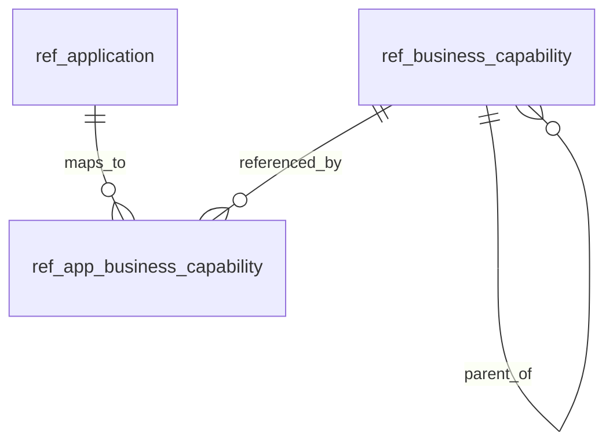

# Business Capabilities

| Field   | Value                |
|---------|----------------------|
| Author  | Ruodong Yang         |
| Date    | 2026-04-18           |
| Status  | Draft                |

---

## 1. Context

Lenovo's EAM system (`it_portal.eam` schema on `10.195.6.89`) maintains a
curated 3-level Business Capability (BC) taxonomy (5,080 rows) and a
many-to-many mapping from applications to BCs at the leaf (L3) layer.
Today only 19 of 4,342 CMDB applications are mapped (0.4% coverage) — the
mapping is a growing asset maintained manually by the EA Team.

NorthStar's App Detail page needs to surface this BC mapping so an
architect looking at an application can immediately see **what business
capabilities it provides**. This grounds the App Detail page in business
language, not just technology topology.

This feature adds a new **"Capabilities"** tab on `/apps/[app_id]` and
the full data pipeline behind it: sync EAM → NorthStar Postgres →
backend endpoint → frontend component.

### Key Design Decisions

| Decision | Rationale |
|----------|-----------|
| **Sync to NorthStar PG, no live EAM proxy** | CLAUDE.md invariant: "App search surface = Postgres relational tables" and "master-data writes come from `sync_from_egm.py`". A live EAM proxy would fragment the data architecture and break offline use. Sync cadence is daily (weekly_sync.sh) + on-demand via env-sync. |
| **Mirror both `bcpf_master_data` and `biz_cap_map`** | The mapping alone is useless without the taxonomy (names, levels, domain path, owners). Both tables are small (≤6k rows total) — full refresh every sync is fine. |
| **Keep L1/L2 denormalization from EAM** | `bcpf_master_data` already carries `lv1_domain` / `lv2_sub_domain` / `lv3_capability_group` on every row. Preserve this — the tab groups by L1→L2 with zero recursive traversal. |
| **New tab, not section in Overview** | BC is a first-class ontological concept and deserves room to grow (future: tree view, cross-app heatmap, Impact-tab integration via graph). Consistent with existing optional tabs (Diagrams, Confluence, Investments — all badge-gated). |
| **Alembic forward migration (002_*), not flat SQL** | Per Schema Evolution Rules (CLAUDE.md): baseline 001–018 is frozen; all new schema lives in Alembic from `002_*` onwards. |
| **No graph write in this feature** | The AGE graph stays untouched. Adding `:BusinessCapability` nodes is a separate future feature (§12). The loader invariant "graph = projection of relational" still holds; this tab just reads PG. |
| **Read-only; EAM is SoT** | NorthStar does NOT offer any UI to create/edit mappings. Mapping authority stays in EAM, owned by the EA Team. |

---

## 2. Functional Requirements

### 2.1 Sync Pipeline

| ID | Requirement |
|----|-------------|
| FR-1 | `scripts/sync_from_egm.py` MUST mirror `eam.bcpf_master_data` into `northstar.ref_business_capability`. Sync config already exists in the SYNCS array; this feature instantiates the backing table. |
| FR-2 | `scripts/sync_from_egm.py` MUST mirror `eam.biz_cap_map` into `northstar.ref_app_business_capability`, keyed by the mapping row's `id` (uuid). |
| FR-3 | Both syncs MUST be idempotent — running twice produces identical table state (full refresh via stage-table UPSERT, same pattern as `ref_application`). |
| FR-4 | The mapping sync MUST NOT fail when a `biz_cap_map` row references a `bcpf_master_id` that is absent from `bcpf_master_data` (stale data is logged, row still stored; display layer filters). |

### 2.2 Backend API

| ID | Requirement |
|----|-------------|
| FR-5 | Backend MUST expose `GET /api/apps/{app_id}/business-capabilities` returning a grouped-by-L1 structure. See `api.md` §1 for the contract. |
| FR-6 | The endpoint MUST resolve each mapping row via `bcpf_master_id → ref_business_capability.id` join; mapping rows pointing at missing master data MUST be silently filtered (and counted separately in response meta for debugging). |
| FR-7 | The endpoint MUST return a `taxonomy_versions` field listing distinct non-null `data_version` values across the app's mappings, so the frontend can flag version drift. |
| FR-8 | The endpoint MUST return `last_synced_at` from the sync bookkeeping so the footer can show "Last sync: 2 hours ago". |
| FR-9 | Non-CMDB apps (diagram-hash app_ids with `X` prefix) MUST receive a valid empty response, not a 404. |

### 2.3 Frontend Tab

| ID | Requirement |
|----|-------------|
| FR-10 | A new tab labeled **"Capabilities"** MUST be added to `/apps/[app_id]`, inserted immediately after Overview and before Integrations. |
| FR-11 | Tab count badge MUST show total mapped BC count when >0; MUST be hidden when 0 (no "0" badge). |
| FR-12 | Mapped state MUST group capabilities by L1 Domain → L2 Subdomain → L3 leaf, with L1 count next to the domain header. |
| FR-13 | Each L3 leaf row MUST display: `bc_id` (monospace) + `bc_name` (EN) + `bc_name_cn` (italic small, below EN, omitted when empty) + owner line. |
| FR-14 | Owner line format: `Biz: <biz_owner> (<biz_team>) · DT: <dt_owner> (<dt_team>)`. Missing values show `—`. The entire owner line is hidden only when all four fields are empty. |
| FR-15 | L1 domain headers MUST be collapsible; default state is all expanded. |
| FR-16 | Empty state MUST explain "This application hasn't been mapped to any business capability in EAM yet. Mapping is maintained in EAM by the Enterprise Architecture team." — neutral, no external CTA. |
| FR-17 | Footer meta row MUST show: `Source: EAM · Last sync: <relative> · Taxonomy v<version>` — with a `⚠` + inline note when `taxonomy_versions` has more than one entry. |
| FR-18 | Hovering a `bc_id` or leaf name MUST show the BC description as a tooltip. |

---

## 3. Non-Functional Requirements

| ID | Requirement |
|----|-------------|
| NFR-1 | Response uses `ApiResponse<T>` envelope (`success` / `data` / `error`), snake_case keys. |
| NFR-2 | Alembic migration `002_business_capabilities.py` MUST be additive only — both tables are new, no ALTER on existing tables. Both `upgrade()` and `downgrade()` implemented. |
| NFR-3 | Alembic migration MUST include `SET search_path TO northstar, public;` inside each `op.execute(...)` block. |
| NFR-4 | Sync writes to the live tables MUST be UPSERT on natural key (`bcpf_master_data.id` for taxonomy; `biz_cap_map.id` uuid for mapping). The live tables MUST NEVER be TRUNCATE'd — a stage-table pattern isolates full-refresh semantics from the live read path. |
| NFR-5 | API response MUST return within 200ms p95 for any app (bounded: max ~100 BCs per app even at steady-state; single indexed join). |
| NFR-6 | Tab MUST gracefully degrade when backend is down or sync is stale >7 days (show cached data with a warning banner, not a crash). |
| NFR-7 | Visual styling MUST conform to DESIGN.md Orbital Ops language — dark base, amber `#f6a623` accent only on count badge, sharp radii, no gradients. Monospace for `bc_id`; Space Grotesk for names; italic CN subtitle. |
| NFR-8 | No authentication or RBAC added — NorthStar is internal network only (CLAUDE.md). |

---

## 4. Acceptance Criteria

| ID | Given / When / Then | Ref |
|----|---------------------|-----|
| AC-1 | **Given** `A000005` has 7 BC mappings across 4 L1 domains in `biz_cap_map`, **When** the user opens `/apps/A000005` and clicks the Capabilities tab, **Then** the tab shows 4 collapsible L1 groups, each with its subtree, each leaf showing `bc_id` + EN name + CN name (if present) + owner line. | FR-10 to FR-15 |
| AC-2 | **Given** `A003000` has 0 BC mappings, **When** the user opens the Capabilities tab, **Then** the empty state message is shown, count badge is hidden, and footer still shows sync meta. | FR-11, FR-16, FR-17 |
| AC-3 | **Given** `A002507` has mappings spanning `data_version` `1.4`, `1.7`, `1.8`, **When** the Capabilities tab renders, **Then** the footer shows `Taxonomy v1.4/v1.7/v1.8 ⚠ mixed versions`. | FR-7, FR-17 |
| AC-4 | **Given** a non-CMDB diagram-only app (app_id starts with `X`), **When** the user opens Capabilities tab, **Then** response is 200 with empty list, not 404. | FR-9 |
| AC-5 | **Given** `scripts/sync_from_egm.py` is run twice with no EAM-side changes, **When** comparing `ref_app_business_capability` before and after the second run, **Then** row count and content are byte-identical. | FR-3 |
| AC-6 | **Given** a mapping row's `bcpf_master_id` points at a deleted master, **When** the API is called, **Then** that row is filtered from results and `response.meta.orphan_mappings` is > 0. | FR-4, FR-6 |
| AC-7 | **Given** the Alembic migration `002_*` is applied, **When** `alembic current` is run, **Then** it returns `002_business_capabilities` and the two new tables exist in `northstar.*`. | NFR-2 |

---

## 5. Edge Cases

| ID | Scenario | Expected Behavior |
|----|----------|-------------------|
| EC-1 | `biz_cap_map.bc_id` is NULL but `bcpf_master_id` is valid (seen: `A004604` row). | Resolve display `bc_id` from the master join, ignore the NULL raw column. |
| EC-2 | `bcpf_master_id` FK dangles (master row deleted between syncs). | Filter from response, increment `meta.orphan_mappings` counter. Log once per sync. |
| EC-3 | `data_version` NULL on mapping row. | Treat as "unversioned"; exclude from `taxonomy_versions` set; do NOT trigger the mixed-version ⚠ warning. |
| EC-4 | `bc_name_cn` is empty string (not NULL). | Omit CN subtitle entirely (don't render empty italic line). |
| EC-5 | All owner fields empty on a BC. | Hide the owner line entirely; do not show `Biz: — · DT: —`. |
| EC-6 | One L1 domain contains >20 leaves for a single app. | Render all — no virtualization needed at this volume. Observed max is 7 total per app. |
| EC-7 | Sync fails mid-run (stage-table fetch partial or merge interrupted). | Stage table may be in a partial state; the live table remains consistent with the prior successful sync (never observably empty or partially updated). Sanity check: abort merge if stage row count is `< 50%` of prior live count. |
| EC-8 | User opens tab before first sync has ever run. | Empty state renders. Footer shows `Last sync: never`. |
| EC-9 | Backend returns 500 (e.g., DB connection lost). | Frontend shows inline error banner inside tab, rest of page still works. |
| EC-10 | Same app mapped to same BC twice (duplicate `(app_id, bcpf_master_id)`). | Not expected per EAM data model, but tolerate: DISTINCT in API SQL, no frontend duplication. |

---

## 6. API Contracts

See `api.md` §1 for full endpoint contract. Summary:

- `GET /api/apps/{app_id}/business-capabilities` → grouped BC structure + meta
- No mutations, no POST/PUT/DELETE in this feature (EAM is source of truth).

---

## 7. Data Models

### 7.1 New PostgreSQL Tables

See `api.md` §2 for full column-level DDL.

**`northstar.ref_business_capability`** (mirrors `eam.bcpf_master_data`):
- PK: `id` (bigint, preserved from EAM)
- Natural key: `bc_id` + `data_version` (NOT unique on `bc_id` alone — taxonomy versions coexist)
- Core display: `bc_name`, `bc_name_cn`, `level`, `lv1_domain`, `lv2_sub_domain`, `lv3_capability_group`, `bc_description`
- Ownership: `biz_owner`, `biz_team`, `dt_owner`, `dt_team`
- Sync bookkeeping: `synced_at` (timestamptz, set by sync script)

**`northstar.ref_app_business_capability`** (mirrors `eam.biz_cap_map`):
- PK: `id` (uuid, preserved from EAM)
- FK: `bcpf_master_id` → `ref_business_capability.id` (NOT enforced — EAM can have dangling refs; handled in app layer)
- `app_id` (matches `ref_application.app_id`)
- `bc_id` (raw from EAM, may be NULL — informational only)
- `data_version` (nullable)
- Source timestamps: `source_created_at`, `source_updated_at` (preserved from EAM's `create_at`/`update_at`)
- Sync bookkeeping: `synced_at`

**Indexes:**
- `ref_business_capability (bc_id)` — for taxonomy lookups
- `ref_business_capability (level, lv1_domain)` — for future BC tree view
- `ref_app_business_capability (app_id)` — **critical** for the endpoint's primary access pattern
- `ref_app_business_capability (bcpf_master_id)` — for reverse lookup (future: BC detail page)

### 7.2 No AGE Graph Changes

This feature does NOT add `:BusinessCapability` nodes or edges. Queries hit PG directly. Graph integration is deferred — see §12.

### 7.3 Simplified ER

---

## 8. Affected Files

### Backend
- `backend/alembic/versions/002_business_capabilities.py` — new migration, creates both tables + indexes
- `backend/app/routers/apps.py` (or new `backend/app/routers/business_capabilities.py`) — new `GET /api/apps/{app_id}/business-capabilities` handler
- `backend/app/models/schemas.py` — `BusinessCapabilityLeaf`, `CapabilityL2Group`, `CapabilityL1Group`, `AppBusinessCapabilitiesResponse` Pydantic models
- `backend/app/services/business_capabilities.py` — new service module, pure-SQL data access (no graph)
- `backend/app/main.py` — register new router (if separate)

### Frontend
- `frontend/src/app/apps/[app_id]/page.tsx` — add `"capabilities"` to tab state type + tab button + lazy-fetch pattern
- `frontend/src/app/apps/[app_id]/CapabilitiesTab.tsx` — new component (tab content, grouping, empty state, footer)
- `frontend/src/lib/api.ts` — add `getAppBusinessCapabilities(appId)` helper (if convention used)

### Database / Scripts
- `scripts/sync_from_egm.py` — add `biz_cap_map → ref_app_business_capability` entry to SYNCS array (master entry already exists per prior inspection)

### Tests
- `api-tests/test_business_capabilities.py` — new test file, covers AC-1 through AC-7 at API layer
- `scripts/test-map.json` — register the new router-to-test mapping

### Docs
- `.specify/features/business-capabilities/spec.md` (this file)
- `.specify/features/business-capabilities/api.md` (created alongside)

---

## 9. Test Coverage

### API Tests

| Test File | Covers |
|-----------|--------|
| `api-tests/test_business_capabilities.py::test_app_with_multi_domain_mapping` | AC-1 |
| `api-tests/test_business_capabilities.py::test_app_with_no_mapping_returns_empty` | AC-2, AC-4 |
| `api-tests/test_business_capabilities.py::test_mixed_taxonomy_versions_reported` | AC-3 |
| `api-tests/test_business_capabilities.py::test_sync_is_idempotent` | AC-5 |
| `api-tests/test_business_capabilities.py::test_orphan_mapping_filtered` | AC-6 |
| `api-tests/test_business_capabilities.py::test_alembic_head_applied` | AC-7 |

### Frontend

No automated UI tests (NorthStar has no Playwright suite). Manual verification:
1. Open `/apps/A000005` → click Capabilities tab → see 4 L1 domains with correct grouping and owners
2. Open `/apps/A000100` (unmapped) → see empty state
3. Open `/apps/A002507` → footer shows mixed-version warning

---

## 10. Cross-Feature Dependencies

### This feature depends on:

| Feature | Dependency Type | Details |
|---------|----------------|---------|
| `sync_from_egm` infrastructure | Runtime | Uses existing master-data sync mechanism (SYNCS array, stage-table pattern). |
| Alembic forward layer | Schema | First real `002_*` migration; validates the baseline→forward bridge. |
| App Detail page tab framework | UI | Extends the existing `tab: useState<Tab>` pattern on `/apps/[app_id]`. |

### Features that depend on this:

| Feature | Dependency Type | Details |
|---------|----------------|---------|
| (future) BC detail page `/capabilities/{bc_id}` | Data | Will reverse-query `ref_app_business_capability` by `bcpf_master_id`. |
| (future) Command palette BC search | Data | Will search `ref_business_capability.bc_name` / `bc_name_cn`. |
| (future) `:BusinessCapability` graph node | Data | AGE loader will project `ref_*` into graph. |

---

## 11. State Machine / Workflow

Stateless. Data flow is one-way: EAM → sync → PG → API → UI. No write-back, no user-triggered mutations.

---

## 12. Out of Scope / Future Considerations

| Item | Reason |
|------|--------|
| `:BusinessCapability` node + `(:Application)-[:PROVIDES]->(:BusinessCapability)` edge in AGE graph | Deferred. Enables Impact-tab integration ("if I change this app, which capabilities are affected?") but requires loader changes + graph ontology RFC. Separate feature. |
| BC detail page (`/capabilities/{bc_id}`) with reverse app list | Deferred. Valuable second view (from BC, find apps), but the App→BC direction is the higher-frequency use case per architect usage patterns. |
| BC search in command palette | Deferred. Adds a new entity type to `CommandPalette.tsx`. Cleanest after BC detail page exists. |
| BC heatmap / matrix visualization across domains | Deferred. Dashboard-style, not reference-tool. Check against strategic positioning first. |
| Editing mappings from NorthStar UI | Out of scope permanently. EAM owns mapping authority. NorthStar is read-only for master data. |
| External "View in EAM" deep link | User chose to skip — EAM UI URL not yet stable. Can be added in a one-line change later. |
| Tree view of the full 5,080-row BC taxonomy | Not needed for the App tab. Fits better in a future `/capabilities/` index page. |
| Supporting multiple taxonomy versions simultaneously | Current UI shows a warning but does not help resolve. If multi-version becomes common, revisit. |
