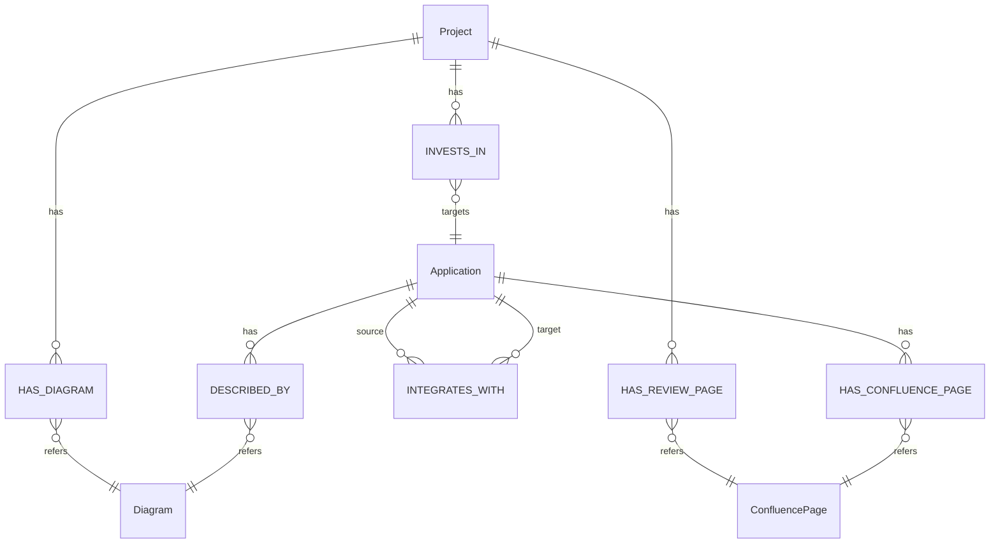
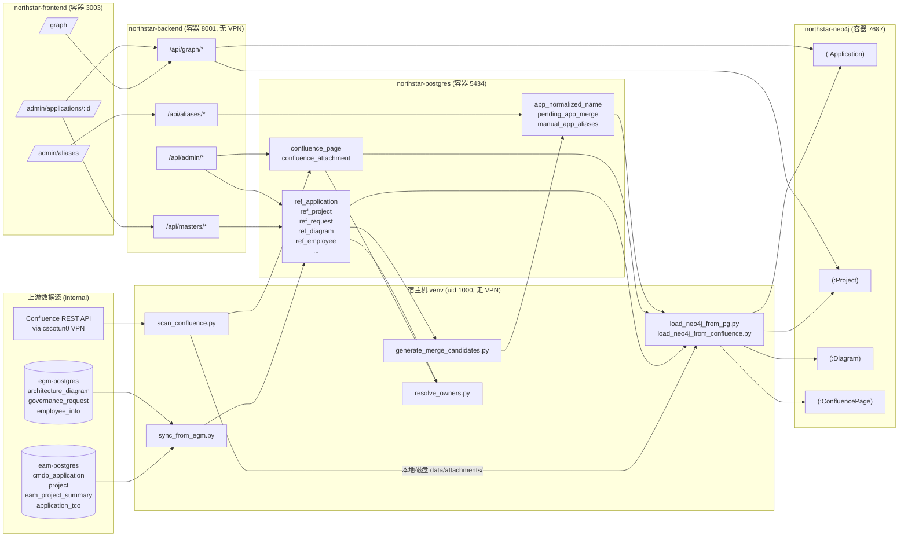
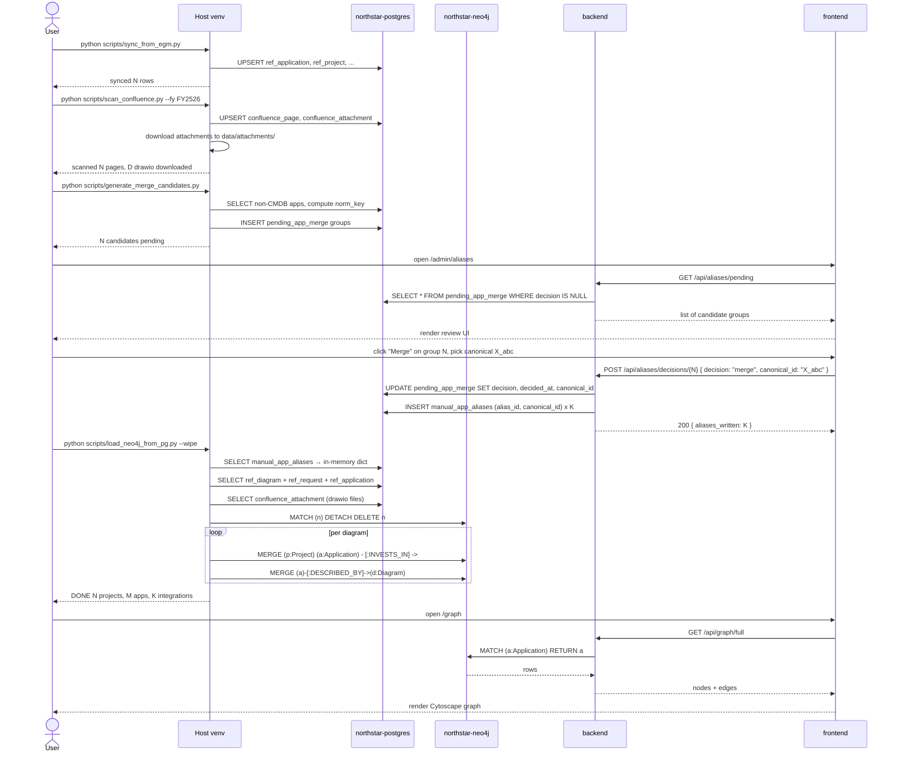
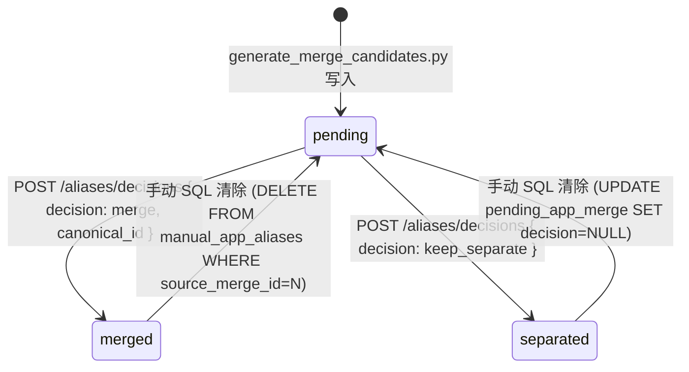

# Ontology Fix — 架构视图(中文)

配合 `spec.md` 和 `api.md` 使用。本文档给架构师看用的,包含背景、ER 图、组件图、时序图、跨特性依赖。

---

## 1. 背景

NorthStar 的原始图谱模型把项目对应用的"归属关系"直接写在 `:Application` 节点上(`source_project_id` / `source_fiscal_year`)。这种设计对应用是**短命的一次性实体**这一假设是正确的,但 IT 应用主数据其实是**长期存活**的:同一个 `A000001 ECC` 会被多个财年的多个项目反复投资、改造、治理。把时间和归属塞进节点属性,导致 loader 每次跑都会覆盖历史,失去"哪个项目在哪年投资了这个 app"的信息。

这个修复把时间维度移到**边属性**,用 `(:Project)-[:INVESTS_IN]->(:Application)` 表达归属。同一个应用可以有 N×M 条边(N 个项目 × M 个财年)。

同时顺带:
- 把 drawio 文件本身建模为一类节点 `:Diagram`,因为同一个物理文件可能同时来自 EGM 缓存和 Confluence 扫描
- 把 Confluence 页建模为 `:ConfluencePage`,让 "A-id 页" 和 "应用节点" 之间有显式边
- 建立人工合并审核流程(pending_app_merge → manual_app_aliases),让非 CMDB 应用的重复能被人判断后聚合

---

## 2. Neo4j ER 图(节点 + 边)

**关键约束**(见 `neo4j_client.py::SCHEMA_STATEMENTS`):
- `app_id_unique` — Application.app_id 唯一
- `project_id_unique` — Project.project_id 唯一
- `diagram_id_unique` — Diagram.diagram_id 唯一
- `confluence_page_unique` — ConfluencePage.page_id 唯一
- `invests_in_fy_idx` — :INVESTS_IN 边上 fiscal_year 属性的关系索引(Neo4j 5 特性)

---

## 3. 数据源 → PG → Neo4j 组件图

**重点**:
1. **VPN 隔离** — Scan / Sync / Load 等 job 都在**宿主机 venv** 跑(uid 1000,Cisco AnyConnect 路由),backend 容器无法访问公司内网
2. **本地磁盘作 S3 替代** — Confluence 附件下载后存 `data/attachments/<id>.ext`,backend 容器通过只读 bind mount 读
3. **Alias 决策闭环** — pending_app_merge(候选)→ 人工决策 → manual_app_aliases(权威)→ loader 应用 → 下次 Neo4j 状态生效

---

## 4. 时序图:一次 Neo4j 重建的完整流程

---

## 5. 权限 / 安全

当前 NorthStar 是内部工具,未实现 RBAC。所有 `/api/*` 端点对访问到 192.168.68.71:8001 的任何请求都开放。

**未来 RBAC**(Phase 2,不在本 feature 范围):

| 操作 | admin | arch_reviewer | viewer |
|-----|:-:|:-:|:-:|
| GET /api/graph/* | Y | Y | Y |
| GET /api/aliases/pending | Y | Y | — |
| POST /api/aliases/decisions/{id} | Y | Y | — |
| 手动 SQL 改 manual_app_aliases | Y | — | — |

---

## 6. 跨特性依赖

本特性是 **L3 跨特性** 的。见 `docs/features/_DEPENDENCIES.json` 里的完整边关系。

**关键共享表**:
- `ref_application` (被 core-graph / masters / admin-applications / ingestion / load-neo4j 同时读)
- `manual_app_aliases` (aliases 写,load-neo4j / ingestion 读)
- `confluence_attachment` (scan-confluence 写,admin-confluence / load-neo4j 读)

**关键共享 Neo4j 边**: `:INVESTS_IN` — 4 个 loader (load_neo4j_from_pg, load_neo4j_from_confluence, ingestion.py, scripts/ingest.py) 都要写它,所有读图的路由 (graph, analytics) 都要查它。**任何对这条边 shape 的改动都是 L3+ High 风险**,必须走完整 closed-loop。

---

## 7. 状态机:Alias 决策生命周期

关键不变量:
- `pending_app_merge.decision = 'merge'` 时,`canonical_id` 必须非空,且是 `candidate_ids[]` 里的某一个
- `pending_app_merge.decision = 'merge'` 时,`manual_app_aliases` 必须有 (len(candidate_ids) - 1) 条新行
- 两张表通过 `manual_app_aliases.source_merge_id FK` 关联,保证回滚路径清晰

---

## 8. 遗留问题 / 已知限制

| 项 | 限制 | 规避方式 |
|---|---|---|
| name_normalize 规则过于保守 | 当前仅做大小写/空格/标点去除 + 中英 tokenize,某些真同义 pair 仍会被分开 | 未来用 embedding 模型做 clustering |
| pending_app_merge 的人工成本 | 如果有 1000+ 组要审核,UI 需要键盘批量操作 | 当前是 Phase 1,只要 UI 能跑就行 |
| 手动 alias 没有过期/review 机制 | 一旦写入,永久生效 | 通过 source_merge_id 可追溯 |
| 无 undo UI | 需要手动 SQL 回滚 | 够用 |
| Tech_Arch 的 interaction 抽取 | `has_graph_data=false`,跳过 | 另起 feature Tech_Arch 解析 |
