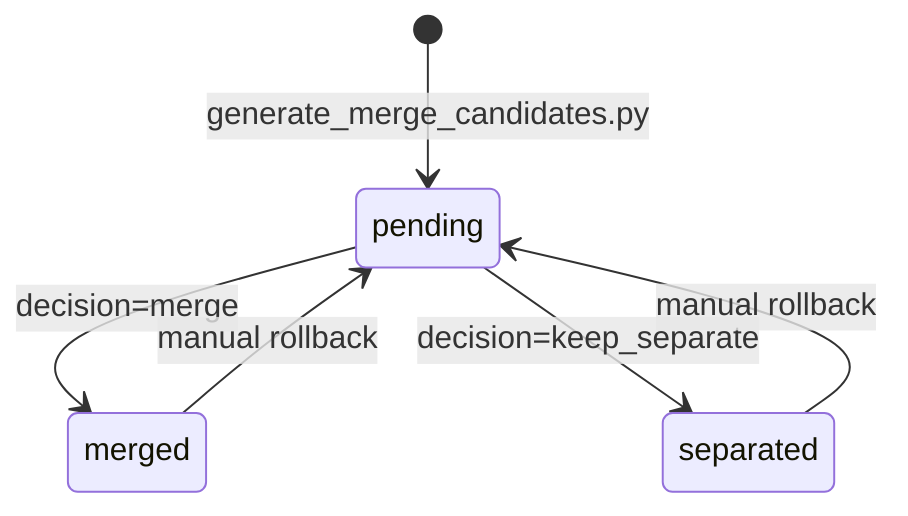

# Ontology Fix

| Field   | Value                     |
|---------|---------------------------|
| Author  | Ruodong Yang              |
| Date    | 2026-04-10                |
| Status  | Implemented — First closed-loop pilot GREEN 2026-04-10 |

## 0. Pilot run record (2026-04-10)

First pass of the closed-loop v2 cycle against this feature uncovered three
real bugs plus one test-framework defect, all fixed:

| Failing test | Root cause | Fix |
|---|---|---|
| `test_application_has_no_source_project_id` | 1531 nodes still carried legacy scalars; Neo4j had never been wiped since the ontology refactor | `python scripts/load_neo4j_from_pg.py --wipe` |
| `test_manual_alias_targets_exist` | `northstar.manual_app_aliases` table did not exist | `psql < backend/sql/003_ontology_fix.sql` |
| `test_tech_arch_diagram_has_no_graph_data` | Loader was marking 3 Tech_Arch drawios with `has_graph_data=true` (loader bug, not spec drift) | Guard `and diagram_type == 'App_Arch'` in `load_neo4j_from_pg.py` |
| `test_node_detail_includes_investments` | Backend container was running a stale image (code on disk had been updated but container never rebuilt) | `docker compose up -d --build backend` |
| `test_backend_health` / `test_graph_nodes_fiscal_year_filter_via_invests_in` (`Event loop is closed`) | Session-scoped httpx AsyncClient reused across per-test event loops | Switch `api` fixture to function-scoped in `api-tests/conftest.py` |

Final pytest result: **15 passed, 1 skipped** (the skip is `test_manual_alias_targets_exist` which only activates once `manual_app_aliases` has rows — deliberate).

---

## 1. Context

The initial NorthStar MVP modelled the IT architecture graph as
`(:Application {source_project_id, source_fiscal_year, ...})` — each
application "belonged" to a single project at a single point in time.
This was wrong for two reasons:

1. **Applications are long-lived entities**, but projects are time-boxed.
   A real app like `A000001 ECC` gets invested in by many projects across
   many fiscal years. Storing a single `source_project_id` on the node
   caused the loader to overwrite the project/FY every run, losing history.
2. **Duplicated non-CMDB apps** — when a drawio cell had no standard ID
   (no `A\d{5,6}` prefix), the loader fell back to a hash of
   `(name|project_id)`. Two projects drawing the same internal app got
   two different X-prefixed nodes that humans could see were the same.

The ontology fix moves the time dimension onto a new
`(:Project)-[:INVESTS_IN]->(:Application)` edge with `fiscal_year` and
`review_status` on the edge, adds first-class `:Diagram` and
`:ConfluencePage` nodes, and introduces a human-in-the-loop alias system
(`pending_app_merge` + `manual_app_aliases`) for collapsing non-CMDB
duplicates after the fact.

### Key Design Decisions

| Decision | Rationale |
|----------|-----------|
| **Time dimension on edge, not node** | An application can be invested in by N projects in M fiscal years → N×M edges, each preserving its own context. Nodes stay stable. |
| **Diagram as first-class node** | Both EGM and Confluence can describe the same physical drawio file. A `:Diagram` node with `source_systems: ['egm','confluence']` deduplicates them. |
| **ConfluencePage as first-class node** | Application pages (A-id in title) and project review pages are now explicit graph nodes, enabling queries like "which apps have Confluence documentation". |
| **Hash-scoped by diagram, not project** | Prevents cross-diagram accidental merges. Canonical collapse happens only via the explicit manual_app_aliases table, never by heuristic. |
| **Alias map applied at load time** | The loader reads `manual_app_aliases` into memory and rewrites X-ids on MERGE. Cheap, idempotent, human-auditable. |
| **Post-ontology loaders must be wipe-and-reload** | Changing node shape is not safely in-place migratable for a graph DB. `scripts/load_neo4j_from_pg.py --wipe` is the canonical way to apply. |

---

## 2. Functional Requirements

### 2.1 Graph Schema

| ID | Requirement |
|----|-------------|
| FR-1 | `:Application` nodes MUST NOT carry `source_project_id` or `source_fiscal_year` properties. |
| FR-2 | `:Application` nodes MUST carry `app_id` (PK), `name`, `status`, `cmdb_linked`, `description`, `last_updated`. |
| FR-3 | Project→Application ownership MUST be expressed via `(:Project)-[:INVESTS_IN]->(:Application)` edges. |
| FR-4 | `:INVESTS_IN` edges MUST carry `fiscal_year` and `review_status` properties; `last_seen_at` SHOULD be set by loaders. |
| FR-5 | A single Application MAY have multiple `:INVESTS_IN` edges from different Projects in different fiscal years. |
| FR-6 | `:Diagram` nodes MUST carry `diagram_id` (PK), `diagram_type` (`App_Arch`|`Tech_Arch`|`Unknown`), `file_kind` (`drawio`|`image`|`pdf`), `file_name`, `source_systems` (string array), `has_graph_data` (bool). |
| FR-7 | `:Diagram` nodes MAY carry `egm_diagram_id`, `confluence_attachment_id`, `confluence_page_id`, `download_path`, `local_path` for traceability. |
| FR-8 | Tech_Arch diagrams and non-drawio attachments (image/pdf) MUST be created as `:Diagram` nodes with `has_graph_data=false`. They produce no `:INTEGRATES_WITH` edges but can still be linked to `:Application` via `:DESCRIBED_BY`. |
| FR-9 | `:ConfluencePage` nodes MUST carry `page_id` (PK), `title`, `page_type` (`application`|`project`|`other`), `page_url`, `fiscal_year`. |
| FR-10 | Applications with a matching A-id Confluence page MUST have a `(:Application)-[:HAS_CONFLUENCE_PAGE]->(:ConfluencePage)` edge. |
| FR-11 | Projects with a matching LI/RD/FY Confluence review page MUST have a `(:Project)-[:HAS_REVIEW_PAGE]->(:ConfluencePage)` edge. |

### 2.2 Alias System (non-CMDB app deduplication)

| ID | Requirement |
|----|-------------|
| FR-12 | A PG table `app_normalized_name` MUST store a normalized key per non-CMDB app (`X\w{12}`) for fuzzy grouping. |
| FR-13 | A PG table `pending_app_merge` MUST list candidate groups (apps sharing a norm_key) awaiting human review. |
| FR-14 | A PG table `manual_app_aliases` MUST store confirmed alias→canonical mappings, one row per non-canonical id. |
| FR-15 | The loader MUST load `manual_app_aliases` at startup and apply it in `derive_app_id()` for non-CMDB apps. |
| FR-16 | An admin API `POST /api/aliases/decisions/{merge_id}` MUST accept a human decision (merge|keep_separate) and populate `manual_app_aliases` accordingly. |
| FR-17 | Reclassifying a pending_app_merge row to `merge` MUST insert one `manual_app_aliases` row per non-canonical candidate_id, each pointing at the chosen canonical_id. |

### 2.3 Loaders

| ID | Requirement |
|----|-------------|
| FR-18 | `scripts/load_neo4j_from_pg.py` MUST be the canonical graph builder and MUST use the new ontology (no source_project_id on Application, INVESTS_IN edges, etc.). |
| FR-19 | `scripts/load_neo4j_from_confluence.py` MUST use the same ontology. |
| FR-20 | `backend/app/services/ingestion.py` (FastAPI BackgroundTask ingestion) MUST use the same ontology. |
| FR-21 | `scripts/ingest.py` (standalone host runner) MUST use the same ontology. |
| FR-22 | All four loaders MUST derive canonical app_id via `derive_app_id(std_id, name, diagram_id, cmdb_hit, alias_map)`: CMDB hit → return std_id; otherwise X-prefix hash seeded by `name|diagram_id`, then looked up in alias_map for final canonical id. |

### 2.4 Read APIs

| ID | Requirement |
|----|-------------|
| FR-23 | `GET /api/graph/nodes` MUST support optional `fiscal_year=` filter, returning applications that have at least one `:INVESTS_IN` edge with matching `fiscal_year`. |
| FR-24 | `GET /api/graph/nodes/{app_id}` MUST return the application plus: outbound/inbound integrations, investments[] (list of projects with fiscal_year), diagrams[] (via `:DESCRIBED_BY`), confluence_pages[] (via `:HAS_CONFLUENCE_PAGE`). |
| FR-25 | `GET /api/graph/full?fiscal_year=` MUST return only apps with at least one matching INVESTS_IN edge. |
| FR-26 | `GET /api/analytics/summary?current_fy=` MUST compute `new_apps_current_fy` as "apps where some INVESTS_IN edge has fiscal_year=current_fy AND the Application's status='New'". |

---

## 3. Non-Functional Requirements

| ID | Requirement |
|----|-------------|
| NFR-1 | Cypher queries MUST NOT produce cartesian products. Use MATCH `()` WHERE clauses or OPTIONAL MATCH, not `MATCH (a), (b)`. |
| NFR-2 | Loaders MUST be idempotent — re-running `load_neo4j_from_pg.py` on a populated graph MUST produce the same result. |
| NFR-3 | The alias_map applied at load time MUST NOT silently merge apps that were previously separate — the result is visible in Neo4j immediately and reversible by deleting the `manual_app_aliases` row and reloading. |
| NFR-4 | Unique constraints in Neo4j: `app_id_unique`, `project_id_unique`, `diagram_id_unique`, `confluence_page_unique`. |
| NFR-5 | Indexes: `app_status_idx`, `app_cmdb_linked_idx`, `project_fy_idx`, `diagram_type_idx`, `invests_in_fy_idx` (relationship index on `:INVESTS_IN.fiscal_year`). |

---

## 4. Acceptance Criteria

| ID  | Given / When / Then | Ref |
|-----|---------------------|-----|
| AC-1 | **Given** an `:Application` node, **When** I query its properties, **Then** it MUST NOT have `source_project_id` or `source_fiscal_year`. | FR-1 |
| AC-2 | **Given** a `:Project` node and an `:Application` node, **When** the loader merges a project that includes the app, **Then** a `(:Project)-[r:INVESTS_IN]->(:Application)` edge MUST exist with `r.fiscal_year` and `r.last_seen_at` set. | FR-3, FR-4 |
| AC-3 | **Given** two projects in different fiscal years both investing in the same CMDB app, **When** I look at the Application, **Then** it MUST have exactly 1 node with exactly 2 `:INVESTS_IN` edges. | FR-5 |
| AC-4 | **Given** a `:Diagram` node created from both EGM and Confluence sources, **When** I read `source_systems`, **Then** it MUST be an array containing both `egm` and `confluence`. | FR-6 |
| AC-5 | **Given** a Tech_Arch drawio file, **When** the loader ingests it, **Then** a `:Diagram` node MUST be created with `has_graph_data=false` and no `:INTEGRATES_WITH` edges. | FR-8 |
| AC-6 | **Given** `manual_app_aliases` contains `{alias_id: 'X_abc', canonical_id: 'X_def'}`, **When** the loader encounters a non-CMDB app that would compute to `X_abc`, **Then** the resulting Application node MUST have `app_id='X_def'`. | FR-15, FR-22 |
| AC-7 | **Given** a `pending_app_merge` row with decision=NULL, **When** I POST `{decision:'merge', canonical_id:'X_abc'}` to `/api/aliases/decisions/{id}`, **Then** the row gets `decision='merge'` + `decided_at`, AND `manual_app_aliases` MUST contain one row per non-canonical candidate_id mapping to `X_abc`. | FR-16, FR-17 |
| AC-8 | **Given** the graph has an Application in multiple fiscal years, **When** I call `GET /api/graph/nodes?fiscal_year=FY2526`, **Then** the response MUST include it IFF at least one `:INVESTS_IN` edge has `fiscal_year='FY2526'`. | FR-23 |
| AC-9 | **Given** an Application node, **When** I call `GET /api/graph/nodes/{app_id}`, **Then** the response MUST include an `investments[]` array with `{project_id, name, fiscal_year, review_status}` per INVESTS_IN edge. | FR-24 |

---

## 5. Edge Cases

| ID | Scenario | Expected Behavior |
|----|----------|-------------------|
| EC-1 | An application page's A-id is not in CMDB (orphan). | Still create `:ConfluencePage` node and `:Application` node (if drawn in a drawio); mark `cmdb_linked=false`. |
| EC-2 | A diagram file exists in Confluence but has no drawio content (e.g. an image). | Create `:Diagram` node with `file_kind='image'` or `'pdf'`, `has_graph_data=false`. No apps extracted. |
| EC-3 | A pending_app_merge decision is changed from merge → keep_separate. | Delete the rows this decision previously wrote into manual_app_aliases. Next loader run will un-merge. |
| EC-4 | Two different CMDB apps appear with the same name in different diagrams. | Both have distinct standard_ids → they become distinct Application nodes via CMDB keys. No merge. |
| EC-5 | A non-CMDB app appears in 3 diagrams and gets 3 different X-ids initially; human merges all 3. | First decision picks one canonical_id; subsequent decisions must use the same canonical_id. |
| EC-6 | Loader runs while backend is live. | Safe — Neo4j MERGE is transactional per statement. Readers see partial state momentarily, not corruption. |
| EC-7 | The alias_map references an alias_id that no longer exists in the current graph. | Ignored by the loader (MERGE just creates the canonical_id node fresh if needed). |

---

## 6. API Contracts

See `api.md` for full contracts. High-level summary:

- `GET /api/graph/nodes` — query existing, now with semantics change on `fiscal_year`
- `GET /api/graph/nodes/{app_id}` — response shape extended with `investments[]`, `diagrams[]`, `confluence_pages[]`
- `GET /api/graph/full` — query existing, semantics change on `fiscal_year`
- `GET /api/analytics/summary` — semantics change on `new_apps_current_fy`
- `GET /api/aliases/pending` — new: list pending merge candidates
- `POST /api/aliases/decisions/{merge_id}` — new: record human decision
- `GET /api/aliases/applied` — new: list currently applied manual_app_aliases

---

## 7. Data Models

### 7.1 Neo4j (see `arch.md` section 2 for full diagram)

| Label / Edge | Keys/Props | Cardinality |
|--------------|-----------|-------------|
| `:Application` | app_id PK, name, status, cmdb_linked, description | 1 per canonical app |
| `:Project` | project_id PK, name, fiscal_year, pm, it_lead, dt_lead, page_type, page_url | 1 per project review |
| `:Diagram` | diagram_id PK, diagram_type, file_kind, file_name, source_systems[], has_graph_data | 1 per physical file (EGM+Confluence dedup) |
| `:ConfluencePage` | page_id PK, title, page_type, page_url, fiscal_year | 1 per scanned page |
| `:INVESTS_IN` | fiscal_year, review_status, last_seen_at | Project→App, many-per-project |
| `:INTEGRATES_WITH` | interaction_type, business_object, status, direction, protocol | App→App |
| `:DESCRIBED_BY` | (none) | App→Diagram |
| `:HAS_DIAGRAM` | (none) | Project→Diagram |
| `:HAS_CONFLUENCE_PAGE` | (none) | App→ConfluencePage |
| `:HAS_REVIEW_PAGE` | (none) | Project→ConfluencePage |

### 7.2 PostgreSQL (new tables in `backend/sql/003_ontology_fix.sql`)

- `app_normalized_name` (app_id PK, raw_name, norm_key, diagram_id, first_seen_at, last_seen_at)
- `pending_app_merge` (id SERIAL PK, norm_key, candidate_ids[], raw_names[], projects[], decision, decided_at, decided_by, canonical_id, note)
- `manual_app_aliases` (alias_id PK, canonical_id, decided_at, decided_by, source_merge_id FK, note)

See `api.md` for column-level definitions.

---

## 8. Affected Files

### Backend
- `backend/app/routers/aliases.py` — **new** router for pending_merge + alias decisions
- `backend/app/routers/graph.py` — response shape change on `/nodes/{app_id}`
- `backend/app/services/graph_query.py` — rewritten to use INVESTS_IN
- `backend/app/services/neo4j_client.py` — new SCHEMA_STATEMENTS for Diagram + ConfluencePage constraints + relationship index
- `backend/app/services/ingestion.py` — MERGE uses INVESTS_IN
- `backend/app/models/schemas.py` — ApplicationNode no longer has source_*; new ProjectAppInvestment, DiagramNode, ConfluencePageNode, PendingMergeCandidate, MergeDecisionRequest, ManualAppAlias
- `backend/app/main.py` — include aliases router

### Frontend
- `frontend/src/lib/api.ts` — ApplicationNode type updated; new ProjectAppInvestment type
- `frontend/src/app/graph/page.tsx` — detail drawer shows `cmdb_linked` + link to full /nodes/{id}
- `frontend/src/app/admin/layout.tsx` — new "App Aliases" nav tab
- `frontend/src/app/admin/aliases/page.tsx` — **new** page for merge review

### Database
- `backend/sql/003_ontology_fix.sql` — new PG tables (idempotent, auto-runs via init scripts)

### Scripts
- `scripts/load_neo4j_from_pg.py` — primary loader, rewritten for new ontology + alias_map
- `scripts/load_neo4j_from_confluence.py` — loader from Confluence attachments, same ontology
- `scripts/ingest.py` — standalone host runner, same ontology
- `scripts/generate_merge_candidates.py` — **new** batch job that populates app_normalized_name + pending_app_merge

---

## 9. Test Coverage

### API Tests
| Test File | Covers |
|-----------|--------|
| `api-tests/test_ontology.py::test_application_has_no_source_project_id` | AC-1 |
| `api-tests/test_ontology.py::test_invests_in_edge_has_fiscal_year` | AC-2 |
| `api-tests/test_ontology.py::test_multi_fy_single_application` | AC-3 |
| `api-tests/test_ontology.py::test_diagram_source_systems_array` | AC-4 |
| `api-tests/test_ontology.py::test_tech_arch_diagram_no_graph_data` | AC-5 |
| `api-tests/test_ontology.py::test_manual_alias_collapses_app` | AC-6 |
| `api-tests/test_aliases.py::test_merge_decision_writes_alias` | AC-7 |
| `api-tests/test_graph.py::test_graph_nodes_fiscal_year_filter` | AC-8 |
| `api-tests/test_graph.py::test_node_detail_includes_investments` | AC-9 |

### Test Map Entries

See `scripts/test-map.json`. The relevant mappings:
```
backend/app/services/graph_query.py    → test_ontology.py, test_graph.py
backend/app/services/neo4j_client.py   → test_ontology.py
backend/app/routers/aliases.py         → test_aliases.py
scripts/load_neo4j_from_pg.py          → test_ontology.py
```

---

## 10. Cross-Feature Dependencies

See `docs/features/_DEPENDENCIES.json`. This feature is cross-cutting (L3+).

### This feature depends on:
| Feature | Dependency Type | Details |
|---------|----------------|---------|
| core-graph | Cypher read | All graph queries must handle the new ontology |
| masters | PG read | Loader reads ref_application for CMDB hits |
| scan-confluence | Table read | Loader reads confluence_attachment for drawio files |
| sync-egm-eam | Table read | Loader reads ref_diagram for EGM-cached XML |

### Features that depend on this:
| Feature | Dependency Type | Details |
|---------|----------------|---------|
| dashboard | Indirect | KPIs aggregate over the new edge shape |
| admin-applications | Indirect | Detail page shows "Appears in Projects" from INVESTS_IN |
| admin-projects | Indirect | Detail page shows "Applications" from INVESTS_IN |

---

## 11. State Machine / Workflow

### Alias decision lifecycle

| From Status | Action | To Status | Guard |
|-------------|--------|-----------|-------|
| `pending` (decision=NULL) | `POST /api/aliases/decisions/{id}` with `decision=merge, canonical_id=X` | `merged` | canonical_id must be one of the candidate_ids |
| `pending` | `POST /api/aliases/decisions/{id}` with `decision=keep_separate` | `separated` | — |
| `merged` | Manual DB edit (delete from manual_app_aliases) | `pending` | Re-open requires clearing decision fields |



---

## 12. Out of Scope / Future Considerations

| Item | Reason |
|------|--------|
| Automatic clustering of pending_app_merge groups | Current norm_key is rule-based; embedding-based clustering is future phase 2 |
| Undo UI on /admin/aliases | Manual SQL only for now; UI is phase 2 |
| Merge decision audit log separate from manual_app_aliases | Sufficient history comes from source_merge_id FK for now |
| Cross-diagram app linking via fuzzy NAME match (not hash) | Deferred — need Approach for handling conflict when names match but semantics differ |
| Tech_Arch graph extraction | FR-8 intentionally does not extract INTEGRATES_WITH from tech diagrams; Tech_Arch interpretation is a separate feature |
